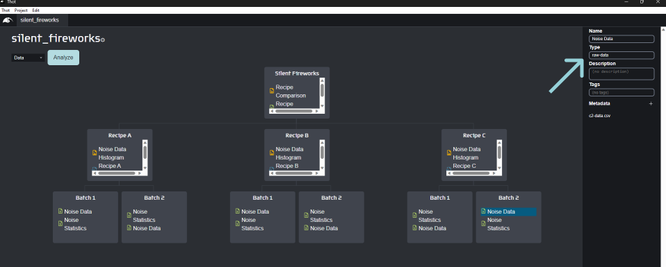
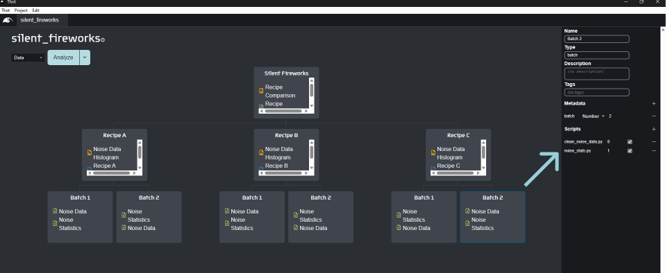
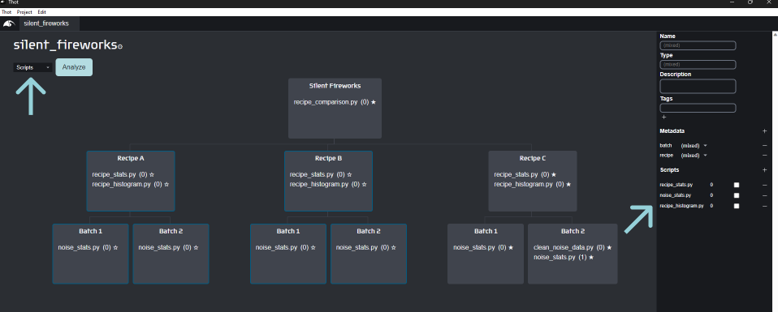

# Advanced tutorial | Puzzle's Fireworks
> :clock9: **10 minutes**

> **Note**
> This project depends on the [intermediate fireworks tutorial project](/beginner/fireworks).
> If you don't have it, you can [download it](/intermediate/fireworks#adjusting-workflows) at the bottom of that tutorial.

## Before we begin
The scripts in this tutorial rely on additional libraries. Ensure they are install before beginning.
<details>
<summary>Python</summary>

+ [scipy](https://scipy.org/)
</details>
<details>
<summary>R</summary>

+ [moments](https://cran.r-project.org/web/packages/moments/index.html)
</details>

## Cleaning up our data
Our engineers got back to us regarding the outlier in our data.
It turns out that the equipment they used can only measure down to 70 dB, so we
can remove any measurements below that as an error.
Let's create a new analysis script to handle this.

### Reorganizing data
We only have a problem in Recipe C > Batch 2, so we'll start by restricting our changes to that Container.
We'll first adjust our noise data in Recipe C > Batch 2 by changing the `type` to **raw-data**.

This script will search for an Asset of `type` **raw-data**, clean it, and create a new Asset of `type` **noise-data**.
This processed noise data will then flow through the rest of the work flow as normal.



Create a new project script called `clean_noise_data` with the contents below, and associate it with the Recipe C > Batch 2 Container.
<details>
<summary>Python</summary>

```python
# import libraries
import pandas as pd
import thot

# initialize thot database
db = thot.Database(dev_root="/absolute/path/to/silent_fireworks/data/Recipe C/Batch 2")

# get data
noise_data = db.find_asset(type="raw-data")
df = pd.read_csv(noise_data.file, index_col=0)

# remove invalid data
clean_df = df[df > 70].dropna()

# save cleaned data
data_path = db.add_asset(
    "noise_data-cleaned.csv",
    name="Noise Data - Cleaned",
    type="noise-data",
    tags=["cleaned"] # tag the data as cleaned for future reference
)

clean_df.to_csv(data_path)
```
</details>
<details>
<summary>R</summary>

```R
# import libraries
suppressPackageStartupMessages(library(tidyverse))
library(thot)

# initialize thot database
#db <- database(dev_root = "/absolute/path/to/silent_fireworks/data/Recipe C/Batch 2")
db <- database(dev_root = "C:\\Users\\carls\\Downloads\\thot_tutorials\\adv_fireworks_r\\data\\Recipe A-1-1\\Batch 2")

# get data
noise_data <- db |> find_asset(type = "raw-data")
df <- noise_data@file |> read_csv(
  col_types = cols(
    Trial = col_integer(),
    `Volume [dB]` = col_double()
  )
)

# remove invalid data
clean_df <- df |> filter("Volume [dB]" > 70)

# save cleaned data
data_path = db |> add_asset(
  "noise_data-cleaned.csv",
  name="Noise Data - Cleaned",
  type="noise-data",
  tags=list("cleaned") # tag the data as cleaned for future reference
)

clean_df |> write.csv(data_path, row.names = FALSE)
```
</details>

But how do we tell Thot that the `noise_stats` Script needs to run after the `clean_noise_data` Script?

### Analysis dependencies
We can stack our analysis scripts like legos by using the **order** parameter. Within a Container, Scripts run from lowest order to highest (e.g. 0 then 1 then 2). Scripts with the same order run in parallel, and all scripts with a certain order will complete before moving to the next.

Set the `noise_stats` Script's order to **1**, leaving the `clean_noise_data` order at **0**.



This allows us to keep our Scripts small and reuse them across projects.

Before we analyze the project, we can save ourselves some time by telling Thot not to run analyses we know haven't changed.
Select all the Recipe A and Recipe B Containers -- the Recipe and Batch Containers -- and uncheck the **autorun** boxes in the Scripts section.
You can see which Scripts will run on the Containers by setting the preview to **Scripts** and checking the star icon.



Analyze the project, and look at the results.

## Organizing Assets
With all these caveats in our data, let's create some more advanced plots so we can really evaluate what is going on.

Create a new script called `adv_recipe_stats` and add it to your project with the following contents

<details>
<summary>Python</summary>

```python
# import libraries
import numpy as np
import pandas as pd
from scipy.stats import norm
import thot

# initialize thot database
db = thot.Database(dev_root="/absolute/path/to/silent_fireworks/data/Recipe A")

# get data
noise_data = db.find_assets(type="noise-data")
df = []
for data in noise_data:
    tdf = pd.read_csv(data.file, index_col=0)
    tdf = tdf.rename(columns={"Volume [dB]": data.metadata["batch"]})
    df.append(tdf)

df = pd.concat(df, axis=1)

# combine all data
all_df = pd.DataFrame(df.values.flatten()).dropna()

# --- analysis ---
# check for trend across trials
ax = df.plot()
trial_vol_path = db.add_asset(
    "figs/volume_by_trial.png", # place in the `figs` bucket
    tags=["figure"]
)

ax.get_figure().savefig(trial_vol_path)

# fit normal distribution across all data
norm_fit = norm.fit(all_df)
x_vals = np.linspace(all_df.min(), all_df.max(), 100)
y_vals = norm.pdf(x_vals, *norm_fit)

ax = all_df.plot.hist()
ax.twinx().plot(x_vals, y_vals, c='C1')

norm_fit_path = db.add_asset(
    "figs/norm_fit.png", # place in the `figs` bucket
    tags=["figure"]
)

ax.get_figure().savefig(norm_fit_path)

# description of combined data
desc_df = all_df.describe()
desc_path = db.add_asset("stats/describe_all.csv")  # place in the `stats` bucket
desc_df.to_csv(desc_path)

# skewness of batches
skew_df = df.skew()
skew_path = db.add_asset("stats/skew.csv") # place in the `stats` bucket
skew_df.to_csv(skew_path)
```
</details>
<details>
<summary>R</summary>

```R
# import libraries
suppressPackageStartupMessages(library(tidyverse))
library(moments)
library(ggplot2)
library(thot)

# initialize thot database
db <-
  database(dev_root = "/absolute/path/to/silent_fireworks/data/Recipe A")

# find all data with type `noise-data` in the subtree
noise_data <- db |> find_assets(type = "noise-data")

# load data into a dataframe
trials <- c()
volumes <- c()
batches <- c()
for (data in noise_data) {
  tdf <- data@file |> read_csv( # get file from Asset
    col_types = cols
    (Trial = col_integer(),
      "Volume [dB]" = col_double()))

  trials <- c(trials, tdf[["Trial"]])
  volumes <- c(volumes, tdf[["Volume [dB]"]])
  batches <-
    c(batches, rep(as.integer(data@metadata$batch), count(tdf)))
}

df <- tibble(trial = trials,
             volume = volumes,
             batch = batches)

# --- analysis ---
# check for trend across trials
p <-
  ggplot(data = df, aes(x = trial, y = volumes, group = batch)) + geom_line(aes(color = batch))

trial_vol_path <-
  db |> add_asset("figs/volume_by_trial.png", # place in the `figs` bucket
                  tags = list("figure"))

trial_vol_path |> ggsave(
  plot = p,
  width = 10,
  height = 6,
  dpi = 300
)

# fit normal distribution across all data
mu <- df$volume |> mean()
sigma <- df$volume |> sd()
p <- ggplot(df, aes(x = volume)) +
  geom_histogram(position = "identity",
                 bins = 15, aes(y = after_stat(density))) +
  stat_function(fun = dnorm, args = list(mean = mu, sd = sigma))

norm_fit_path <-
  db |> add_asset("figs/norm_fit.png", # place in the `figs` bucket
                  tags = list("figure"))

norm_fit_path |> ggsave(
  plot = p,
  width = 10,
  height = 6,
  dpi = 300
)

# description of combined statistics
desc_df <- df |> summarise(
  count = n(),
  mean = mean(volume),
  std = sd(volume),
  min = min(volume),
  max = max(volume)
)

desc_path = db |> add_asset("stats/describe_all.csv") # place in the `stats` bucket
desc_df |> write.csv(desc_path, row.names = FALSE)

# skewness of batches
skew_df <- as_tibble(c(skewness(df |> filter(batch == 1) |> pull(volume)),
                       skewness(df |> filter(batch == 2) |> pull(volume))))

skew_path = db |> add_asset("stats/skew.csv") # place in the `stats` bucket
skew_df |> write.csv(skew_path)
```
</details>

Let's explore the results! You can preview the new Assets we created in the desktop app, as usual. If you open the folder of a recipe Container you'll see that the files have been placed into subfolders. These subfolders allow you to organize data without creating additional Containers, and are called **buckets**. A bucket is created when the `file` argument of the `add_asset` function has a relative path, intead of just a file name.

## Which is the best recipe?
What do you think we shall tell Mr. Puzzle's? If you need more info on which is the best recipe, try making your own analysis script from scratch!

# Congratulations!
You've made it through all the tuorials! Now it's time to start using Thot on your own projects.

Remember, if you ever have questions you can chat with us on [our Discord](https://discord.gg/Kv2c5XynfV) or send us an email at <info@thot.so>.