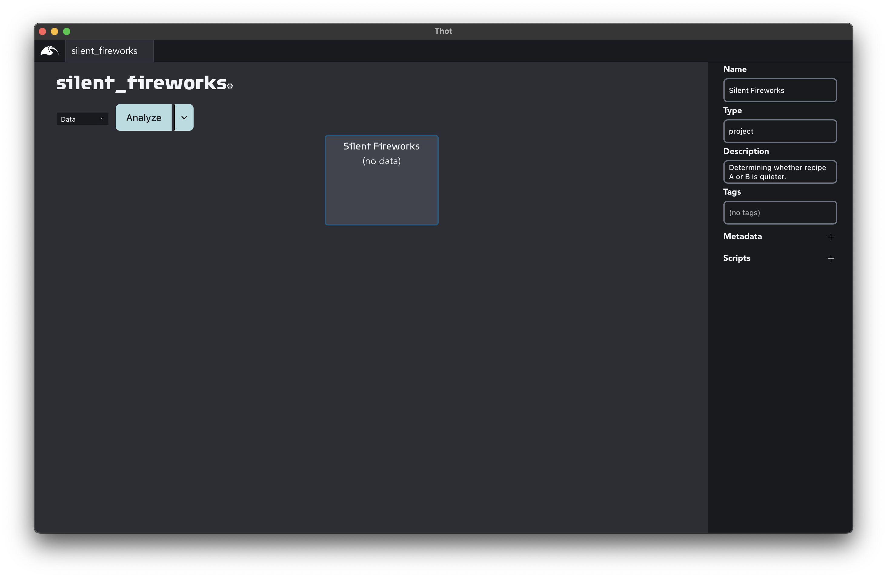
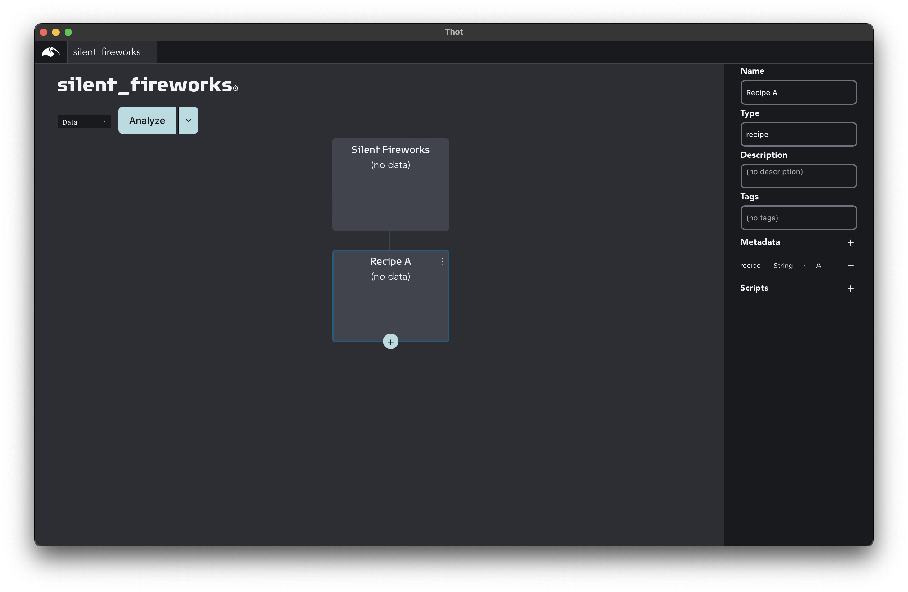
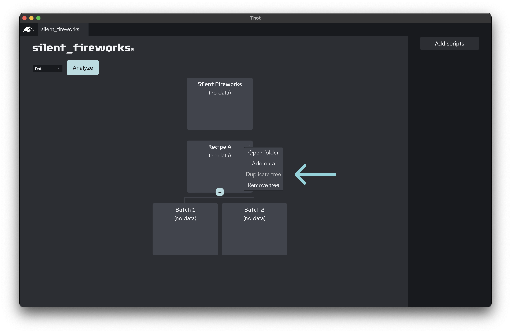
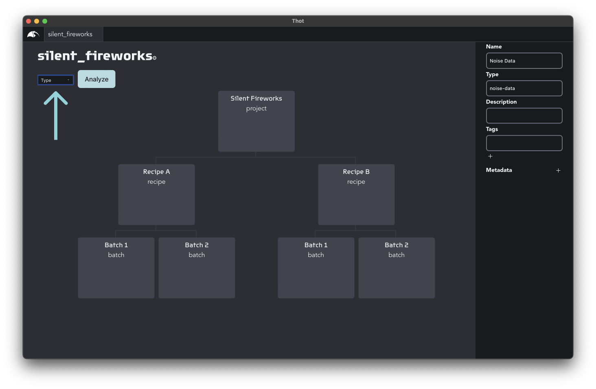

# Beginner tutorial | Puzzle's Fireworks
> :clock9: **15 minutes**

## Puzzle's Fireworks
Congratulations! You've just been hired as the head of the R+D department at Puzzle's Underwater Fireworks company. The city's aquarium just hired us for their annual New Year's Eve extravaganza, and they want to do something extra special this year: fireworks for the fish. Luckily, our team has been working hard for the past six months on two new recipes for silent explosions. A perfect solution so the fish don't get scared. Looks like your first project will be to compare the two recipes to see which is quieter. 

Our deadline is approaching quickly, so we need to put a rush on this project. Luckily, our engineers have already collected the data and written the analysis scripts. It's up to you to run the analysis and get back to us with the results ASAP!

Good luck!

## Before we begin
The analysis scripts used in this project depend on some common libraries. Please ensure they are installed based on your programming language.

### Python
+ [Pandas](https://pandas.pydata.org/getting_started.html)
+ [Matplotlib](https://matplotlib.org/stable/users/getting_started/)

### R
+ [Tidyverse](https://www.tidyverse.org/)

## Creating your first project
Let's start up the desktop app. If this is your first time running it, you'll first have to create a user account. Enter your email and click the **Get Started** button. This will take you to your dashboard.

If you don't have any projects created yet, click on the **Create my first project** button (otherwise click on the **New** button). You'll be asked to select the folder to place the project in. Let's call this one `silent_fireworks`. Each Thot project is contained in its own folder where all the resources for that project are organized.

Once you create the project, you will be taken to the project canvas.

## Structuring your project
The first thing we need to do is build our project structure. Thot uses a tree to organize your projects, giving your project different levels. The top level should be the most important grouping to you, becoming less important as you move down the tree. 

For this project the most important thing we need to test is which recipe is quieter, so our top level grouping will be the recipes. Unfortunately, testing underwater fireworks happens to be quite expensive, so we will only be able to make two batches for each recipe. The batches will be our second level. This gives us the tree below.

Our researchers have already recorded the data and written the analysis scripts for us, so all we need to do is create a Thot project for our experiments and run the analysis.

Because of our short time frame to get this done, we'll build this project quick and dirty, using the most common features of Thot's dersktop app.

### Setting up your project tree
Let's start by annotating our the root **Container** by clicking on it. This will open the properties widget. Enter the following information (leaving the rest blank).

|     |     |
| --- | --- |
| **Name:** | Silent Fireworks |
| **Type:**	| project
| **Description:** | Determining whether recipe A or B is quieter. |

Great! We just edited our first Container. What do Containers do? Well, they Contain things. Namely, they can contain other Containers, Assets, and Script Associations. We'll get to the Assets and Script Associations later on.

#### Adding a child
Let's add our first child Container for Recipe A. You probably noticed the plus icon that appears when you hovered over the root Container. Go ahead and give it a click. This will open the **Add child** dialog. Let's name the child Container **Recipe A**. After creating it, give it a `type` of **recipe**.

|     |     |
| --- | --- |
| **Name:** | Recipe A |
| **Type:** | recipe |

#### Metadata
We'll also add metadata to this Container. This allows us to attach metadata to our data. Child Containers inherit the metadata from their ancestors, but can overwrite it by declaring a new value with the same name.

To add metadata click on the **+** icon in the **Metadata** section and enter the following metadata:

| Name | Type | Value
| --- | --- | ---
| recipe | string | a

On to the batches. Create a child Container of `Recipe A` with the following information:

|     |     |
| --- | --- |
| **Name:** | Batch 1 |
| **Type:** | batch |
| **Metadata:**	| batch (number): 1 |

The notation for the metadata is of the form `Name (Type): Value`.

Repeat this for Batch 2.

|     |     |
| --- | --- |
| **Name:** | Batch 2 |
| **Type:**	| batch |
| **Metadata:** | batch (number): 2 |

Great! We've now created our `Recipe A` branch.

`Recipe B` will have the exact same structure with only the name of the recipe Container changed. Let's save ourselves some work by duplicating the `Recipe A` tree and changing the required information.

Hover over the kebab (three dot) menu in the upper right corner of the `Recipe A` Container and select `Duplicate tree`.

Click on the newly created `Recipe A (Copy)` Container to open its properties widget and change its name to `Recipe B`.

Great! Our project's structure is now complete, and we can start adding data to it.

## Adding data to your project
Now that we have our tree, we can add data. Most often data is added to the lowest level Containers because these are the individual/samples/spicimens we actually run experiments on.
In Thot, any data file -- CSV, text, images, binary, anything -- is called an **Asset**.

> [Download the data]()

Adding data to a Container is as simple as Drag-and-dropping the file on it. For each of the batches, add the respective data. (e.g. Drop `a1-data.csv` on the `Recipe A > Batch 1` Container.) You'll see the Assets appear in the preview as you add them. 

### Bulk editing
Let's edit the names of Assets to make them more descriptive. <kbd>Shift</kbd> + click on each of the newly add files. This opens the `Bulk Editing` widget. Using this same technique you can select multiple Containers as well, or a mix of Containers and Assets.

Set the `name` of the Assets to `Noise Data` and their `type` to `noise-data`.

## Preview
Let's take a brief moment to check that we've assigned the `type`s of the Containers correctly. Change the **Preview** in the upper left of the canvas to `Type`.

Wonderful! We've now created our project structure and added our data. Next we'll look at how to analyze the data using Thot Scripts.

## Analyzing the data
Analysis of a Thot project starts at the bottom most level of the project tree and works its way up. Each **Script** can be thought of as a machine that takes Assets in and produces new Assets. The new Assets can then be consumed by other Scripts. Our analysis scripts have already been implemented, so all we need to do is assign them to the correct Containers.

> **Download the analysis scripts**
> + [Python]()
> + [R]()

> **Note**
> Thot exposes a simple interface that wraps around the actual analysis that you do in your scripts. We cover this in the [intermediate tutorials](/intermediate), but encourage you to open the provided analysis files and take a look for yourself. The longest is 20 lines of code with comments explaining each line.

Associating scripts happens in two steps. First, we'll add the analysis scripts to the project, then we'll associate them to the correct Containers.

Unselect all the **Resources** (Containers and Assets) by clicking an empty spot in the canvas. In the details bar click the **Add scripts** button, and select the three analysis scripts for the project.

Select all the `Batch` Containers and associate the `noise_stats` script to them by clicking the **+** icon in the **Scripts** section of the properties widget. Similarly, add the `recipe_stats` script to both `Recipe` Containers, and the `recipe_comparison` script to the root Container. Change the preview to `Scripts` to verify everything is correct.

We're almost there now! Let's change our preview back to `Data` and click the `Analyze` button to run our analysis.

> **Warning**
> Running the analysis may give you an error. If this occurs, an error with a detailed error message will appear. A common error is that the interpreter path is not available. If you have some programming experience, you can specify the path to use with by opening the **Developer settings** from the **Thot** menu.
>
> If you need any help, never hesitate to send us a message on [Discord](https://discord.gg/Kv2c5XynfV) or at info@thot.so.

Once the analysis is complete you'll see the newly created Assets appear in the project tree. Which recipe is quieter? Open the `Recipe Comparison` Assets in the `Silent Fireworks` Container to find out. (No, you're not seeing double, there are two of them. One is a CSV file and the other is a plot.) To preview an Asset you can double click on it.

## Sharing results
You did it! Mr. Puzzle will be extatic to know which recipe to use for the fishs' fireworks, and just in time, too!

Unfortunately, Mr. Puzzle is a bit of an old timer, and hasn't yet adopted Thot himself yet (we hope you can convince him to try it out, though). Luckily for us, everything in Thot is just files and folders, so sharing the results with him is super simple.

Open the root Container's kebab (three dot) menu and click the **Open folder** action. This will open the data folder of the project, so you can easily send Mr. Puzzle the final plot, justifying your conclusion.

> **Download the final project**
> + [Python]()
> + [R]()

## What next?
The R+D team have just created a new recipe! We'll need to add it to our current project so we can compare it with the current results, and also create our own analysis script.

If you're ready for your next challenge, get started with the [intermediate tutorials](/intermediate), or play around with the current project yourself.

