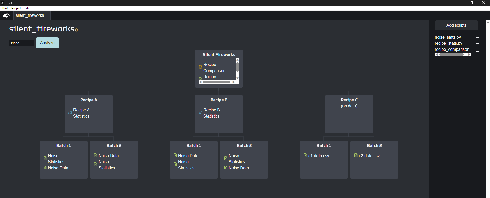

# Intermediate tutorial | Puzzle's Fireworks
> :clock9: **15 minutes**

## Where did we leave off?
Ahh, right. You had just saved the company by determining which of the two firework recipes was quieter. You created your first Thot project by creating the project structure, organizing and annotating the raw data, and analyzing that data to quickly get the results you needed.

The aquarium's New Year's Eve extravaganza went off without a hitch, and both the people and fish loved the show. In the crowd was Famous Dave, from Famous Dave's Scuba Encounters. He was so impressed he wants to put on his own show for his clients, and has asked the Puzzle's team to make it happen!

> **Note**
> This project depends on the [beginner fireworks tutorial project](/beginner/fireworks).
> If you don't have it, you can [download it](/beginner/fireworks#sharing-results) at the bottom of that tutorial.

## A new recipe
The brilliant chemists in Puzzle's R&D department have just sent you a message
> We need your help!
> We just came up with a new recipe for Famous Dave's show, but aren't sure if it's better or worse.
> 
> Here is the data:
> [Recipe C data](https://resources.thot.so/downloads/tutorials/intermediate/fireworks/project_resources/data.zip)
>
> Can you help us?

Of course you can!

## Extending a project
As is typical in science, we always finish projects with more questions than we began, and need to be flexible to new requirements as we progress through our projects. We need an easy way to account for this, and with Thot, we have one.

### New data
Let's extend our project to account for this new recipe. [Duplicate](/beginner/fireworks#duplicating-subtrees) one of the other Recipe branches, and update the `Name` to **Recipe C** and the `recipe` metadata value to **C**.
Let's add the new data in, just as we did before.



We can now re-analyze the project to incorporate the new results and take a look to see if Recipe C is better.

### New analysis
Amazing! It looks like the researchers actually did find a recipe that is quieter. But wait, what is that? The error bar washes out the effect? Looks like we'll need to dig into these numbers a bit deeper to figure out if Recipe C really is better.

Let's write our own script to plot a histogram for all the trials in each recipe.
<details>
<summary>Python</summary>
Create a file called <code>recipe_histogram.py</code>, and add it to the project.
</details>
<details>
<summary>R</summary>
Create a file called <code>recipe_histogram.R</code>, and add it to the project.
</details>

> **Note**
> Adding a script to a project copies it into the project's `analysis` folder, so be sure you are editing the correct file.

#### Interacting with our project
Thot allows us to interact with our project from our scripts. This way we can check our results without having to analyze the project every time we make a change.

Lets start by initializing the database for the script on our Recipe A Container.
Add the following lines to your new analysis script.
<details>
<summary>Python</summary>

```python
# import libraries
import pandas as pd
import thot

# initialize thot database
db = thot.Database(dev_root="/absolute/path/to/silent_fireworks/data/Recipe A")
```
</details>
<details>
<summary>R</summary>

```R
# import libraries
suppressPackageStartupMessages(library(tidyverse))
library(ggplot2)
library(thot)

# initialize thot database
db <- database(dev_root="/absolute/path/to/silent_fireworks/data/Recipe A")
```
</details>

Let's also run these commands in an interpreter so we can interact with our project.
To ensure we are at the correct Container we can print out the name of the root Container of the database.

> **Note**
> Code with a :mortar_board: above it is meant to be run in the interpreter only, not saved into the analysis file.

:mortar_board:
<details>
    <summary>Python</summary>
    
    db.root.name
</details>
<details>
    <summary>R</summary>

    root <- db |> root()
    root@name
</details>

You should see "Recipe A" printed out. 

> **Note**
> The [full API documentation](/api) describes all the available functions for each language, with examples.
> Documentation should also be available using your editors hints.

#### Finding Assets
The first thing we want to do is get the actual data we will operate on. To do this Thot has two API calls:
+ **`find_asset`:** Finds a single Asset matching the provided filter, returning the `None` type for the language if no matches are found. If multiple matches are found, a random one is returned.
+ **`find_assets`:** Finds multiple Assets matching the filter as a `list` in the given language.

We want to get all the data with a `type` of **noise-data**, so we'll use `find_assets`. Add the following to the script, and run it in an interpreter.
<details>
<summary>Python</summary>

```python
# find all data with type `noise-data` in the subtree
noise_data = db.find_assets(type="noise-data")
```
</details>
<details>
<summary>R</summary>

```R
# find all data with type `noise-data` in the subtree
noise_data <- db |> find_assets(type="noise-data")
```
</details>

The `noise_data` variable should now hold a list with two elements. But why only two? We have six Assets with the `type` **noise-data** -- one in each batch.

When running a script, it only has access to the Container it's running on and everything below it. It can't access anything above it or on the same level.
(In fancy talk, a Thot project acts as a [**hierarchical database**](/api#hierarchical-database). This is what allows us to duplicate tree structures without needing to re-program anything.
Because we set the `dev_root` of the database to Recipe A, the `noise_data` variable only contains the noise data from the Recipe A batches. 

Let's verify this.

#### Accessing metadata
For each recipe Container, we assigned the `recipe` metadata. Let's first ensure that our root Container has the correct metadata assigned to it. Run the command

:mortar_board:
<details>
<summary>Python</summary>

```python
db.root.metadata
```
</details>
<details>
<summary>R</summary>

```R
root@metadata
```
</details>

and you will see all the metadata assigned to the Recipe A Container. As you can see, metadata is stored in your languages verion of a dictionary or map. 

Great! Our root Container has its `recipe` metadata set to **A**. But what about the noise data? We haven't assigned any metadata to it, so how can we tell our Batch 1 from our Batch 2 data? Let's take a look at the metadata for each of the Assets.

In the interpreter run

:mortar_board:
<details>
<summary>Python</summary>

```python
for data in noise_data:
    print(data.metadata)
```
</details>
<details>
<summary>R</summary>

```R
for (data in noise_data) {
    print(data@metadata)
}
```
</details>

Woah! Our noise data has metadata attached to it even though we didn't assign any to it. This is because both Containers and Assets **inherit metadata** from their ancestors (Containers higher up in the tree). This way you don't need to copy-paste metadata everywhere. 

> **Note**
> Metadata values are overwritten at lower levels if assigned at multiple levels.

#### Using data
Now that we know we're operating on the correct data, let's actually plot it.
<details>
<summary>Thot's API sandwich</summary>

Thot uses a "sandwich" model for its API, where Thot is the bread. Below you'll see how you start by using Thot to get the data you need from your project. You then do whatever analysis you want (the meat). Finally, you save any new data back into your project.

[Learn more](/api#sandwich-model)
</details>

In the `recipe_histogram` script add the following
<details>
<summary>Python</summary>

```python
# load data into dataframe
df = []
for data in noise_data:
    tdf = pd.read_csv(data.file, index_col=0) # get file from Asset
    tdf = tdf.rename(columns={"Volume [dB]": data.metadata["batch"]}) # rename columns by batch
    df.append(tdf)

df = pd.concat(df, axis=1) # merge dataframes into one
```
</details>
<details>
<summary>R</summary>

```R
# load data into a dataframe
volumes <- c()
batches <- c()
for (data in noise_data) {
  tdf <- data@file |> read_csv(# get file from Asset
    col_types = cols
    (Trial = col_integer(),
      "Volume [dB]" = col_double()))
  
  # store volume and batch
  volumes <- c(volumes, tdf[["Volume [dB]"]])
  batches <-
    c(batches, rep(as.integer(data@metadata$batch), count(tdf)))
}

df <- tibble(volume = volumes, batch = batches)
```
</details>

There are two important things that we learned here:

1. Assets have a `file` property that stores the absolute path to the associated data file.
2. Metadata we assigned in the desktop app is accessible in our analysis scripts.

These two ideas are what give Thot so much power, so it's worth thinking about how you can use them in your own projects for a minute.

Time to see what this data looks like.
In the `recipe_histogram` script add the following
<details>
<summary>Python</summary>

```python
# plot the data
ax = df.plot.hist(alpha=0.5)
```
</details>
<details>
<summary>R</summary>

```R
# plot the data
p <- ggplot(df, aes(x = volume, fill = factor(batch))) +
  geom_histogram(position = "identity",
                 alpha = 0.5,
                 bins = 15)
```
</details>

#### Creating Assets
Let's save the plot as a new Asset into our project.
Add the following code to the `recipe_histogram` script.
<details>
<summary>Python</summary>

```python
# save plot
fig_path = db.add_asset(
    "noise_data_histogram.png",
    name="Noise Data Histogram",
    tags=["figure"],
    description="Histogram of noise data by batch."
)

ax.get_figure().savefig(fig_path)
```
</details>
<details>
<summary>R</summary>

```R
# save plot
fig_path <- db |> add_asset(
  "noise_data_histogram.png",
  name = "Noise Data Histogram",
  tags = list("figure"),
  description = "Histogram of noise data by batch."
)

fig_path |> ggsave(
  plot = p,
  width = 10,
  height = 6,
  dpi = 300
)
```
</details>

> **Note**
> To see a new Asset created in interactive mode in your project you'll need to restart the desktop app.
> The desktop app doesn't currently update if you make changes outside of it.
> This is an update that is coming soon.

Assign the `recipe_histogram` script to the Recipe Containers and re-analyze the project. What do the results show?

> Download the complete `recipe_histogram` script
> 
> + [Python](https://resources.thot.so/downloads/tutorials/intermediate/fireworks/project_resources/recipe_histogram.py)
> + [R](https://resources.thot.so/downloads/tutorials/intermediate/fireworks/project_resources/recipe_histogram.R)

## Adjusting workflows
Oh no! It looks like there is an outlier in the data. How can we deal with this? 
We'll have to give our engineers a call to see what could have caused this.

Check out the [advanced tutorial](/advanced) to resolve the issue.

> Download the final project
> + [Python](https://resources.thot.so/downloads/tutorials/intermediate/fireworks/completed_projects/fireworks_py.zip)
> + [R](https://resources.thot.so/downloads/tutorials/intermediate/fireworks/completed_projects/fireworks_r.zip)
